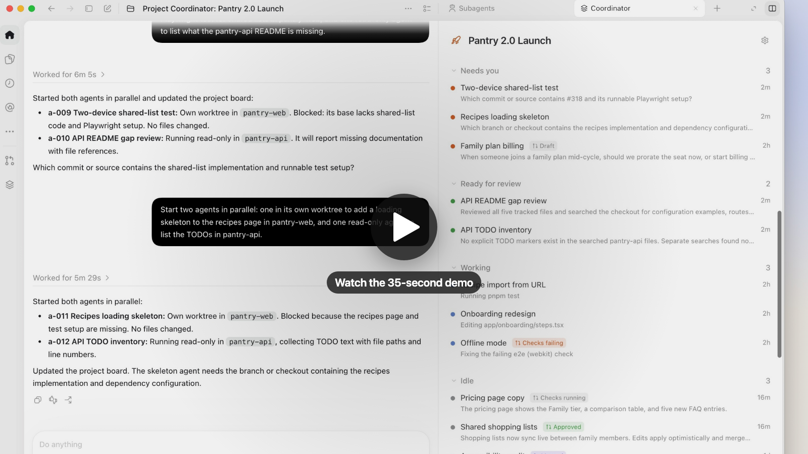
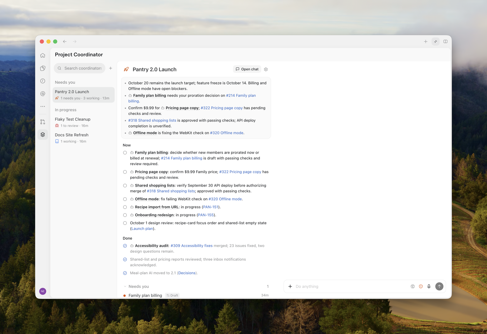

# Project Coordinator for Codex

Project Coordinator is a Codex plugin inspired by Cursor Projects and Claude Code Projects. Each project gets a coordinator chat. It hands each task to a native Codex subagent, gives parallel code changes their own git worktree, tracks what needs you, and keeps notes and memory that every agent reads.

[](docs/demo.mp4)

The prompts and code are original. See [docs/design.md](docs/design.md) for how each pattern maps here and what is not built yet.

> **Status: experimental.** Tested on macOS with the Codex desktop app. It relies on Codex's MCP extensions and on `codex app-server` requests such as `thread/fork`, and on `codex://` deep links. These can change between Codex releases. It is not affiliated with OpenAI, Cursor, or Anthropic.

## What you get

- **Create Coordinator.** Pick an icon, a name, a workspace, and a model. Project Coordinator creates the project's coordinator chat in that workspace, lets the coordinator greet you, and opens it. From then on, the Coordinator page always opens that same chat.
- **A Project Coordinator page in the Codex sidebar.** A project list like Code Review with each project's notes, agents, memory, and files. Click a project to open its coordinator chat.
- **One coordinator chat per project.** It lives in the project's repository folder in the Codex sidebar and is named "Project Coordinator: <name>". It keeps one long thread that compacts but is never replaced, so the coordinator builds up context. A coordinator chat started elsewhere moves into the repository folder the next time you open it from the page.
- **A Coordinator panel beside the chat.** Open it once per coordinator chat from the side panel: **More tools… → Coordinator**. Notes, agents grouped by *Needs you*, *Ready for review*, *Working*, and *Idle*, memory, and all files, in one scrolling panel.
- **Project files in Codex tabs.** All Files lists the project's plans, docs, notes, and memory. A file opens in a Codex file tab, where you can read and edit it and save with ⌘S. The coordinator writes plans and documents with `file_write` and links them in chat and in `notes.md`.
- **A coordinator skill (`$coordinator`).** The coordinator reads a project digest each turn, starts agents, forwards follow-ups, and keeps `notes.md` and memory current.
- **Native Codex subagents.** The coordinator prepares each task with `agent_prepare` and starts it with Codex's own `spawn_agent`. Agents appear in the chat's Subagents tab, where you follow their work or talk to them; clicking an agent in the Coordinator panel opens it too. Each one gets a brief with the project instructions, memory, and its task, and ends with a report: `## Report`, `## Next`, `## Needs you`, and `## Remember`.
- **Worktrees when work runs in parallel.** A task that edits code while other agents may edit the same repository gets a git worktree inside the repository, at `.worktrees/<id>-<title>` on branch `coordinator/<id>-<title>`, hidden from `git status`. Gitignored files listed in `.worktreeinclude`, like `.env`, are copied in. Resolving the agent removes a clean worktree.
- **@-mention a project** in any chat to attach its current status.
- **Pull request follow-up.** The coordinator checks the pull requests in agent reports each turn. Failing checks, requested changes, and merges arrive in its inbox, and it sends the agent a follow-up to fix them.
- **Durable memory.** `MEMORY.md` is an index of typed memory files that every new agent receives. `preferences.md` holds cross-project preferences.



## Install (local)

Requires Node 22.18+, the Codex app, and the `codex` CLI signed in.

```sh
git clone https://github.com/nahuelb/codex-projects-plugin.git
cd codex-projects-plugin
npm install
npm run install:local
codex plugin add codex-projects-plugin@personal
```

Restart the Codex app, then open **Project Coordinator** in the sidebar and click **New Coordinator**.

`install:local` copies the built plugin to `~/plugins/codex-projects-plugin` and lists it in `~/.agents/plugins/marketplace.json`.

To update, pull and run `npm run install:local` again, then restart Codex. To remove it, run `codex plugin remove codex-projects-plugin@personal`. Your projects stay in `~/.codex/plugins/data/codex-projects-plugin-personal` until you delete that folder.

## Try the demo

The video and screenshots above use a demo project, Pantry 2.0 Launch, for a fictional meal-planning app. To explore it without touching your own data:

```sh
node scripts/demo.ts ~/pantry-demo
npm run install:local -- --data ~/pantry-demo/data
codex plugin add codex-projects-plugin@personal
```

Restart Codex and open **Project Coordinator**. The script creates two small git repositories, three coordinators, and agents in every state, with notes, memory, and plans. Run it again to reset the demo. Run `npm run install:local` without `--data` to go back to your own projects.

The demo agents are board records only, with no Codex thread behind them. Ask the demo coordinator to start a new agent to see a real one.

## How it works

```
Codex app ── coordinator chat ($coordinator skill) ── spawn_agent ──► native subagents
   │                                                                     (Subagents tab)
   └── MCP (stdio) ──► dist/server.js ──► ~/.codex/plugins/data/codex-projects-plugin-personal/
          Coordinator page + panel             (files are the record)
```

- Codex runs the agents. The plugin never starts its own agent runtime; the coordinator uses Codex's `spawn_agent`, `send_message`, and `followup_task`.
- The MCP server has no background process. It reads the coordinator chat's session file and each subagent's session file under `~/.codex/sessions` to fill the board: which agents are working, their latest activity, and their final reports.
- One-off Codex requests, such as naming the coordinator chat or moving it into the repository folder, go through a short-lived `codex app-server`.

## Data

The plugin keeps its data where Codex keeps data for every plugin: `~/.codex/plugins/data/<plugin>-<marketplace>`. With the local install, that is:

```
~/.codex/plugins/data/codex-projects-plugin-personal/
  projects/<slug>/
    project.json      name, icon, color, workspace, model, coordinator chat id
    INSTRUCTIONS.md   standing instructions for every agent
    notes.md          the status board (coordinator-owned)
    MEMORY.md         memory index; memory/*.md typed memory files
    docs/ plans/ internal/
    agents/<id>.json  board records: task, task_name, worktree, subagent thread, report
    inbox/            events for the coordinator
  user/preferences.md cross-project preferences
```

Earlier versions used `~/.projects-coordinator`. The plugin moves that folder here the first time it starts, when no agent is working. Set `PROJECTS_COORDINATOR_HOME` to use another folder.

## Notes and limits

- Agents are ordinary Codex subagents: they use the coordinator chat's model, sandbox, and approval settings. With Codex's default sandbox, git commits ask for your approval, because the sandbox keeps `.git` read-only.
- PR checks need `gh` signed in. They run when the coordinator reads the project or the panel refreshes.
- Subagents run inside the Codex app. Quitting Codex stops the ones that are working; ask the coordinator to follow up on them later.
- The plugin launches your own signed-in `codex` CLI. It never handles your credentials.
- Keep project instructions free of secrets: they are sent to every agent.
- The Project Coordinator page, Coordinator panel, quick action, mentions, deep links, and file tabs use OpenAI's MCP extensions. Other MCP hosts show the plain MCP App, if they support MCP Apps. There, files open in a built-in viewer with Preview and Source modes.
- Mobile needs a hosted endpoint and is not built yet.

## Development

```sh
npm run build      # dist/app.html, dist/server.js
npm test           # node --test on the TypeScript sources
npm run typecheck
npm run preview    # the UI in a browser at http://localhost:4321/?mode=panel (or ?mode=home)
```

## License

MIT. See [LICENSE](LICENSE).
